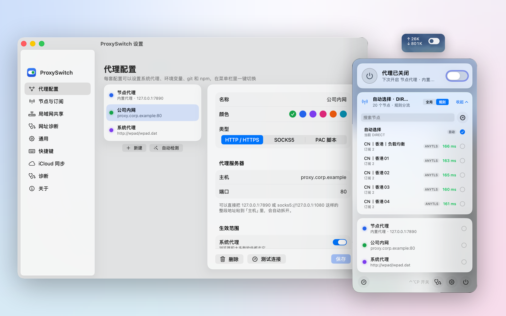
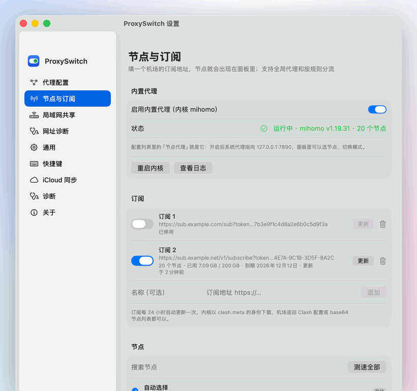
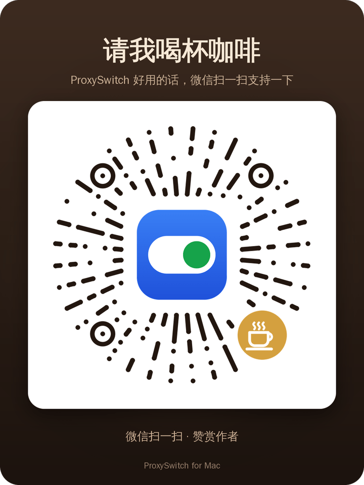

# ProxySwitch for Mac

macOS 菜单栏里的代理开关：一键切换系统代理、环境变量、git 和 npm 的代理设置，多套配置随时切换。原生 Swift 写成，界面是毛玻璃风格，在 macOS 26 上会用系统的 Liquid Glass。

Windows 版在 [proxyswitch](https://github.com/whrss9527/proxyswitch)，两边功能各自演进。

<p align="center"></p>

<p align="center"></p>

## 功能

- **内置节点代理**：填一个机场的订阅地址，节点就出现在面板里，可以选节点、自动选择延迟最低的、一键测速；支持全局代理和按规则分流。没有订阅也能粘贴节点链接或者扫二维码手动添加；订阅可以只保留某些节点、去掉「剩余流量」这类假节点、加名字前缀，还能设前置代理（链式代理）。
- **节点筛选与收藏**：节点列表可以按订阅、地区（从节点名自动认出）、协议筛选，只看能用的或收藏的，按订阅顺序、名字或延迟排序，筛出来的节点一起测速，也能按现在的条件直接建一个策略组；收藏的节点在面板和菜单里排在最前面。
- **导入配置**：Clash / mihomo 的 YAML、Surge / 小火箭 / Quantumult X 的配置、节点链接、规则列表和 ProxySwitch 自己的 JSON 都能导入，粘贴、选文件、填网址或者拖进窗口，导入前先预览会改动什么，可以合并或替换，改错了能撤销。
- **自动化**：命令行工具 `proxyswitch`、给 AI 助手用的 MCP 服务器（Claude Desktop、Claude Code、Cursor 等）和 URL 命令共用一套本机接口，权限分四档；还能按 Wi‑Fi 或路由器自动切换配置和模式。详见 [docs/automation.md](docs/automation.md)。
- **策略组与分流规则**：可以建「流媒体」「Telegram」这样的策略组，按节点名正则筛成员（还能排除一部分、限定只用某几个订阅、把别的组放进来），手动选择、自动选择、故障转移、负载均衡四种类型，面板里每个组单独选节点；自定义规则除了域名和 IP，还能按应用、局域网设备、关键词、通配、正则、端口、进程名、IP 归属地和 AND / OR / NOT 组合匹配；分流规则是一列规则集，按顺序匹配，每条有自己的去向和开关，规则库里收了 blackmatrix7、MetaCubeX、ACL4SSR 的常用规则和 [johnshall 的小火箭规则](https://github.com/johnshall/Shadowrocket-ADBlock-Rules-Forever)，一键添加；也能填任何 `.list` / `.yaml` / `.mrs` 列表或小火箭、Surge 的 `.conf`。
- **连接与流量**：「连接」页列出经内核的每一条连接：哪个程序（或哪台设备）访问了什么、命中了哪条规则、走了哪个策略组和节点、用了多少流量，右键就能让这个域名、这个应用或这台设备固定走某个去向，或者断开它；最近两分钟的网速曲线；按节点、按程序和设备、按天累计流量，显示节点出口和本机直连的出口 IP 与归属。
- **服务检测**：看经某个节点 ChatGPT、Claude、Gemini、Netflix、YouTube Premium、Google、GitHub、Telegram 能不能用、服务认为你在哪个地区；选别的节点检测时不切换正在用的节点。
- **高级设置**：内核自己的 DNS（DoH / DoT / DoQ，海外 DNS 经节点查询，按域名指定 DNS）、Hosts、IPv6、内核配置补丁（写一段 mihomo 的 YAML 合并进去，保存前让内核检查）、内核实时日志。
- **局域网共享**：打开后 PS5、Switch、手机等同一局域网里的设备把这台 Mac 当代理服务器（`Mac 的 IP:7892`），就能享受和本机一样的网络：本机走节点它们就走同样的节点和规则，本机用公司代理它们就转发给公司代理，本机没开代理就经这台 Mac 直连，切换配置时几秒内跟着变。默认只允许局域网网段里的设备，也可以只允许指定的 IP。
- **网址诊断**：某个网站打不开时，填上网址，从这台 Mac 或 PS5 等设备的视角把链路走一遍——本机 / 共享状态、DNS、直连、经代理（从内核日志里抓命中的规则和走的节点）、节点延迟——给一句结论和修复按钮（开启节点代理、让这个域名走节点、自动选择节点）。`open "proxyswitch://diagnose?url=https://youtube.com"` 也能直接发起。
- **菜单栏网速**：图标旁边两行小字显示实时上行、下行速度，可以统计系统整体流量或只算内置代理，网速放在图标左边或右边都行。
- **菜单栏面板**：点图标弹出，大开关、配置列表和每个配置的延迟、复制在当前终端里用代理的命令、一键测速、进设置。右键或 Control + 点击是简洁菜单。
- **多套配置**：HTTP / SOCKS5 / PAC 三种。每套可以选生效范围：系统代理、环境变量、git、npm。
- **系统代理**：读取和监听用 SystemConfiguration，别的程序（Clash、Surge、公司脚本）改了代理会立刻反映在图标上，可以一键保存成配置。写入用 `networksetup`。
- **环境变量**：写到 launchd（`launchctl setenv`），之后新开的终端和程序都能读到；已经打开的终端用面板里复制的 `export` 命令。
- **测速与健康检查**：经代理实际访问测速地址测延迟（PAC 由系统执行，和浏览器一致）；开启期间定期检查代理端口，连不上时提醒。
- **自动检测**：找出本机正在运行的代理软件监听的端口，确认能用后一键添加。
- **全局快捷键**：默认 ⌃⌥P 开关代理，可以在设置里录制新的。
- **登录时启动**：系统设置的「登录项」里可以看到和关闭。
- **命令**：`open proxyswitch://toggle`、`proxyswitch://on`、`proxyswitch://off`、`proxyswitch://use?name=配置名`、`proxyswitch://node?name=节点`、`proxyswitch://mode?value=global`、`proxyswitch://share`（`share/on`、`share/off`）、`proxyswitch://import?url=…`、`proxyswitch://settings`、`proxyswitch://update`，可以接快捷指令和脚本；装上命令行工具后还有 `proxyswitch status`、`proxyswitch node 香港` 这些命令。
- **iCloud 同步**：打开后代理配置和设置通过 iCloud 云盘（`iCloud 云盘/ProxySwitch/config.json`）在多台 Mac 之间同步，几秒内生效；另一台 Mac 开启时可以选用 iCloud 的、用本机的或合并，两边同时改以改动时间晚的为准。
- **检查更新与一键更新**：启动后和每 6 小时检查一次 GitHub 上的新版本（可以关掉），有新版本时通知（通知上直接有「立即更新」按钮），面板里出现更新条。点一下「更新」就会下载本机芯片的精简包、比对 SHA-256、替换 `ProxySwitch.app` 并自动重新启动，不用去下载页。内置代理在运行时经它下载，失败再试系统代理和直连。直接在下载文件夹里打开的程序会被装进「应用程序」，旧的那份移到废纸篓。开发者签名的版本只安装同一个开发者签名的新版本。

## 内置节点代理

1. 设置 → 节点与订阅，粘上机场给的订阅地址点「添加」。内核会下载解析，配置列表里自动多一条「节点代理」。订阅行的齿轮里能设只保留 / 去掉哪些节点（节点名的正则）、名字前缀和前置代理（这个订阅的节点先经配置列表里的某个代理、某个策略组或别的订阅的节点再连出去）。没有订阅时在「手动节点」里粘贴 `ss://`、`vmess://`、`trojan://`、`hysteria2://` 这样的链接，或者从剪贴板、图片、屏幕上扫二维码。
2. 面板里开关「节点代理」就是开关它：开启后系统代理指向 `127.0.0.1:7890`（HTTP 和 SOCKS 同一个端口）。节点卡片里可以选节点、自动选择、测速、切换全局 / 规则。
3. 「策略组」在节点页：建一个组，填名字、选类型（手动选择、自动选择、故障转移、负载均衡）、填节点名的正则筛选（比如 `港|HK`，不区分大小写），面板和右键菜单里每个组单独选节点。手动选择的组多了「节点」「自动选择」和直连三个候选，默认跟随「节点」，所以刚建好时行为不变。每个组的「高级」里能排除节点、限定只用某几个订阅、把别的组放进来、单独设测速地址、间隔和容差，负载均衡可以选轮流、同一网站固定节点或同一会话固定节点。节点列表上方可以按订阅、地区、协议筛选和按延迟排序，筛好后点「按这些条件建策略组」。
4. 「分流规则」页管理规则集：每条规则集有名字、地址、去向（走节点、直连、拦截或某个策略组）和开关，按列表顺序匹配，靠前的优先。「从规则库添加」里有国内直连（内置）、GeoSite 的国内域名 / 被墙网站 / 广告、blackmatrix7 的 Apple / Google / Telegram / Netflix / OpenAI 等分类列表、ACL4SSR 的去广告，以及 johnshall 的几套小火箭完整配置。纯规则列表（`.list`、`.txt`、`.yaml`、`.mrs`）由本程序下载到内核目录、交给内核的 rule-provider 加载，更新不用重启；小火箭 / Surge 的 `.conf` 会转换后并入：`DOMAIN-SUFFIX`、`DOMAIN-KEYWORD`、`IP-CIDR`、`GEOIP`、`RULE-SET`（下载后内联）、`FINAL` 都支持，`USER-AGENT`、`URL-REGEX` 这类内核不支持的会跳过；文件里的策略名和某个策略组同名就指到那个组，其余 `Proxy` 类策略走「节点」。「其余流量」决定没被任何规则命中的流量往哪走，默认跟随规则文件里的 FINAL。GitHub 上的规则国内直连不通时，会经内核或 jsDelivr 镜像下载；还没下载下来的规则集先跳过，不耽误内核启动，内核起来后在后台补下载、下好了自动生效，和订阅同一个间隔自动更新。地址是 `.yaml` 但内容是 Clash 的 `rules:` 配置、或者 `.list` 里其实是小火箭的 `[Rule]` 段时，下载后会认出来，改成转换并入。
5. 「自定义规则」也在分流规则页：让某个域名（含子域名）或 IP / 网段固定走节点、直连、拦截或某个策略组，排在所有规则集前面，全局模式下也生效，改了立刻生效。左边的类型菜单里还有应用（选一个 .app，连同它的辅助进程）、局域网设备（按来源 IP，比如让 PS5 走某个组）、完整域名、关键词、通配、正则、IP 归属地、端口、进程名、协议和 AND / OR / NOT 组合规则。「连接」页和「局域网共享」页的连接上右键就能加。
6. 「连接」页：经内核的连接实时列出（每两秒刷新），本机的连接显示发起的程序名，PS5 等设备的显示它的 IP；「最近的连接」把短连接也记下来。按节点（以及直连、上游代理）累计流量，存在本机、内核重启后接着算，可以清零。「出口 IP」经节点查一次网站看到的地址和归属（切换节点后自动重查），也能查本机直连的公网地址。
7. 内核是 [mihomo](https://github.com/MetaCubeX/mihomo)（Clash Meta，GPL-3.0），以独立程序的形式打包在 `ProxySwitch.app/Contents/MacOS/mihomo`，默认只监听本机端口（开了局域网共享才多一个给局域网设备的入口），配置在 `~/Library/Application Support/ProxySwitch/core/`，规则集文件在它的 `rules/` 里。GeoIP 数据来自 [MetaCubeX/meta-rules-dat](https://github.com/MetaCubeX/meta-rules-dat)。
8. 不支持 TUN 模式：只有走系统代理（或环境变量）的程序会经过它。

## 导入、高级设置和自动化

- **导入**：设置 →「高级」→「导入配置」（节点页、配置页也有入口，或者把文件拖进设置窗口）。Clash 配置里的节点存成一条本机订阅、策略组和规则一起导入；来自网址的配置直接加成订阅和规则集，以后跟着自动更新。导入前会列出要改动的内容和注意事项，选「合并」或「替换」，导入记在操作记录里可以撤销。各种格式具体怎么转换见 [docs/automation.md](docs/automation.md#其他能导入的格式)。
- **高级**：DNS 默认用系统的；打开「用内核自己的 DNS」后，直连的网站和 IP 类规则用加密 DNS 解析，解析结果不在国内时改用经节点查询的海外 DNS，公司内网这类域名可以指定 DNS。Hosts 把域名固定解析到某个地址。内核配置补丁是一段 mihomo 的 YAML：`rules` 排在最前面，`proxies`、`proxy-groups`、`listeners` 追加（同名替换），其余逐层合并；保存前让内核检查，以后内核不认了会自动退回没打补丁的配置。
- **自动化**：本机控制接口的权限（关闭、只能查看、日常操作、完全控制）、命令行工具的安装、给 AI 助手的 MCP 配置、URL 命令、按网络自动切换的规则和操作记录都在「自动化」页。

## 局域网共享（PS5 / Switch）

1. 设置 → 局域网共享，打开「允许局域网里的设备经这台 Mac 上网」。页面上会显示要在设备上填的地址，比如 `192.168.1.5 : 7892`。
2. PS5：设置 → 网络 → 设置 → 设置互联网连接 → 选中正在用的网络 → 高级设置 → 代理服务器 → 「使用」，填 Mac 的 IP 和端口。Switch：设置 → 互联网 → 互联网设置 → 选中网络 → 更改设置 → 代理服务器设置。手机、电脑在 Wi‑Fi 的手动代理里填同样的地址。
3. 之后设备的流量跟着本机走：本机开着「节点代理」，设备就用同样的节点和分流规则（全局 / 规则跟着切）；本机用公司代理或者别的代理软件，就转发给它；本机没开代理，就经这台 Mac 直连。面板里切换配置，设备几秒内跟着变。PAC 脚本没法转发，这时设备直连并在页面上提示。
4. 共享由内置的内核完成：它在 `0.0.0.0:7892` 多开一个入口，用 mihomo 的 `lan-allowed-ips` 只放行局域网网段（10.x、172.16–31.x、192.168.x）；页面上可以改成只允许指定的 IP 或网段。公共 Wi‑Fi 上建议关掉。没有订阅也能开共享，只为共享运行时本机的 7890 端口不占用。
5. 页面上能看到正在使用的设备（来源 IP、连接数、流量、最近访问的站点和走的出口）和「最近的连接」（域名 → 节点 / 直连，命中的规则），还可以从本机经共享端口自测。建议在路由器里给 Mac 固定 IP，不然 IP 变了设备就连不上。开着 macOS 防火墙时第一次会询问是否允许 mihomo 接受传入连接，要允许。
6. 两个限制要知道：PS5 的代理设置只对系统流量（联网测试、PSN、商店）和浏览器生效，YouTube、Netflix 这类应用可能用自己的网络栈、不走代理——打开应用时「最近的连接」里没有出现它的域名就是这种情况，用 PS5 的浏览器打开同一个网站可以对照；游戏联机的 UDP 流量也不经 HTTP 代理。设备自己解析 DNS 被污染、拿着假 IP 来连的情况内核会处理：开着域名嗅探，从 TLS 握手里取回域名再分流。
7. 共享是本机的设置（放在 `state.json`），不跟着 iCloud 同步；右键菜单和 `open proxyswitch://share` 也能开关。

## 安装

1. 在 [Releases](../../releases) 下载 `ProxySwitch-macos.zip`（通用包，Intel 和 Apple 芯片都能用；`-arm64` / `-x86_64` 结尾的是只含一种芯片的精简包，小一半），解压后把 `ProxySwitch.app` 拖到「应用程序」。
2. 用 Developer ID 签名并经过苹果公证的版本（Release 说明末尾会注明），解压后双击就能打开。没有公证的版本第一次打开会被系统拦下：macOS 15 及以后先双击一次，再到「系统设置 → 隐私与安全性」底部点「仍要打开」；macOS 14 在 `ProxySwitch.app` 上右键 → 打开 → 再点「打开」；也可以在终端运行 `xattr -dr com.apple.quarantine /Applications/ProxySwitch.app`。
3. 需要 macOS 14 或更新版本。
4. 之后的版本在程序里一键更新：有新版本时面板里会出现更新条，点「更新」就行，也可以在「关于」页或通知上点「立即更新」。如果程序是在下载文件夹里直接打开的（系统会把它放在只读的临时位置运行），更新时会自动装进「应用程序」，第一次可能会问能否访问「下载」文件夹（用来把旧的那份移到废纸篓）。

## 权限说明

- 修改系统代理需要**管理员账户**。标准账户会弹出系统的授权对话框，输入一次管理员密码。
- iCloud 同步用的是 iCloud 云盘里的普通文件夹（没有开发者签名拿不到 iCloud 的 entitlement），第一次开启时系统可能会询问是否允许访问 iCloud 云盘。
- 全局快捷键用 Carbon 的热键接口，不需要辅助功能权限。
- 通知需要在第一次弹出时允许。
- 按网络自动切换要读 Wi‑Fi 名字，macOS 14 起需要定位权限（ProxySwitch 不读取、不保存位置），不给也可以按路由器认。
- 扫描屏幕上的二维码需要「屏幕录制」权限，第一次会弹出系统询问。
- 安装命令行工具要写 `/usr/local/bin`，会请求一次管理员密码。

## 文件位置

配置、状态和日志都在 `~/Library/Application Support/ProxySwitch/`：`config.json`、`state.json`、`proxyswitch.log`，操作记录在 `journal.json`，导入的节点和规则文件在 `imports/`，本机控制接口的套接字是 `control.sock`。诊断页里可以直接打开这个目录。

## 开发

需要 Xcode 16 或更新版本（用 Xcode 26 编译才有 Liquid Glass）。

```bash
swift build                          # 编译
swift test                           # 单元测试（纯逻辑：命令生成、状态解析、配置读写……）
VERSION=0.1.0 Scripts/build-app.sh   # 组装通用二进制的 dist/ProxySwitch.app 和 zip，ad-hoc 签名
```

设置 `CODESIGN_IDENTITY="Developer ID Application: …"` 时用开发者证书签名；发布时的签名和公证怎么配置见 [docs/signing.md](docs/signing.md)。

代码结构：

| 目录 | 内容 |
| --- | --- |
| `Sources/ProxySwitch/App` | 入口、`AppState`（配置、状态、开关逻辑、导入）、`Engine`（内核、节点、策略组、规则集、连接与流量、服务检测）、本机控制接口、命令行、按网络自动切换 |
| `Sources/ProxySwitch/Models` | 配置、系统代理快照、networksetup 命令的生成、策略组、规则集与规则库、自定义规则、DNS 与 Hosts、手动节点、节点筛选、流量统计、自动化 |
| `Sources/ProxySwitch/System` | 系统代理、环境变量、git / npm、测速、快捷键、登录项、通知、URL 命令、更新、iCloud 文件、内核进程与 API、内核配置生成与补丁、规则转换与下载、YAML、配置导入导出、控制接口的套接字与 MCP、二维码、出口 IP、局域网地址 |
| `Sources/ProxySwitch/UI` | 菜单栏图标与面板、设置窗口各页（节点、分流规则、连接、自动化、高级……）、导入预览、毛玻璃样式、快捷键录制 |
| `Tests` | XCTest |
| `Scripts/build-app.sh` | 组装 .app（下载 mihomo 合成通用二进制、GeoIP 数据库）、签名、打 zip |
| `Scripts/import-certificate.sh`、`Scripts/notarize.sh` | 发布时导入 Developer ID 证书、提交苹果公证并钉上票据 |
| `Resources` | Info.plist、权限声明、图标 |

推送代码时 GitHub Actions 会在 macOS 上编译、测试、打包并启动一次截图，然后用本地 HTTP 服务器假装发布一个 9.9.9 版本，走一遍下载、校验、替换、重新启动的完整更新流程，再用一张临时的自签名证书把签名流程走一遍；推送 `v*` 标签会自动打包并发布 Release，配了证书时顺便签名和公证。

本仓库分支开的合并请求（草稿除外）测试全部通过后自动合并进 main。合并后，如果 `CHANGELOG.md` 最上面的版本还没有标签，就自动打上 `v版本号` 的标签、打包并发布 Release；所以要发版时，在 `CHANGELOG.md` 最上面加一节新版本就行。测试期间 main 有了新提交时不会自动合并，把 main 合进分支再推一次即可。

本机调试更新流程时可以把环境变量 `PROXYSWITCH_UPDATE_URL` 指向一个返回 GitHub releases 格式 JSON 的地址；调试 iCloud 同步时可以用 `PROXYSWITCH_SYNC_DIR` 把同步文件夹指到任意目录（见 `.github/workflows/ci.yml` 里的做法）。

## 请我喝杯咖啡

ProxySwitch 免费开源。觉得好用的话，可以用微信扫一扫请我喝杯咖啡 ☕（程序里「设置 → 关于」也有这张码，点一下能放大）。

<p align="center"></p>

## 许可证

[MIT](LICENSE)
